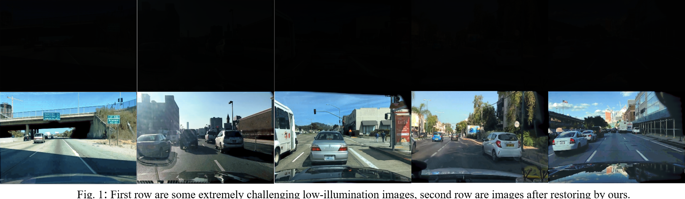
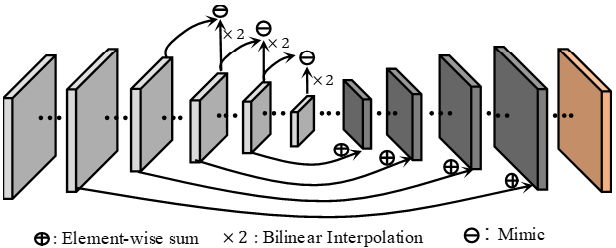
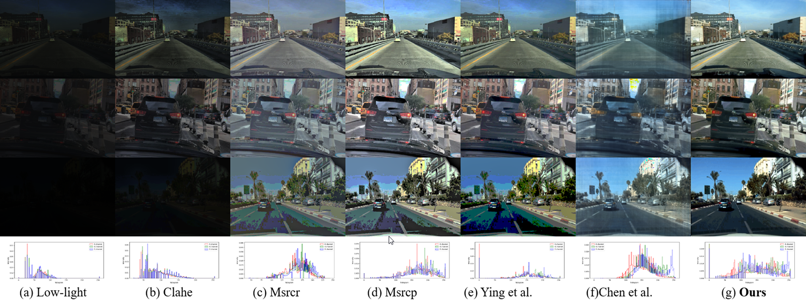
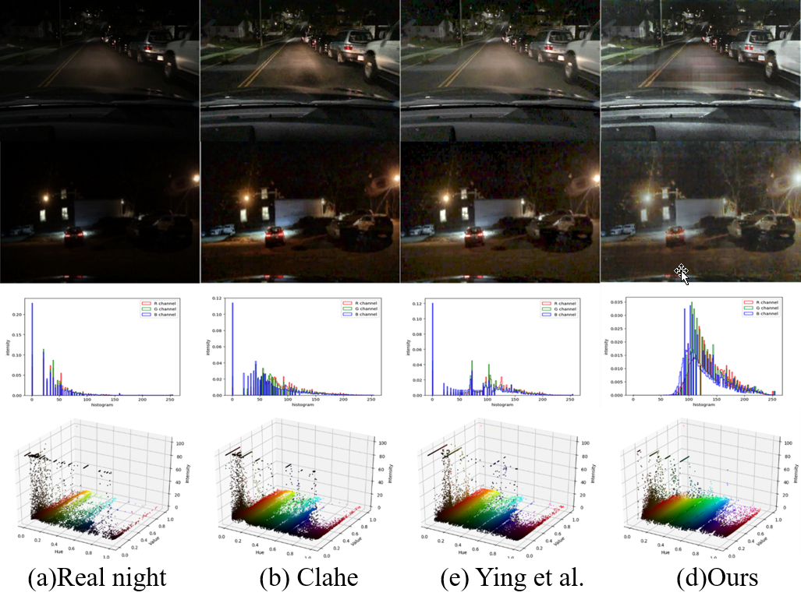
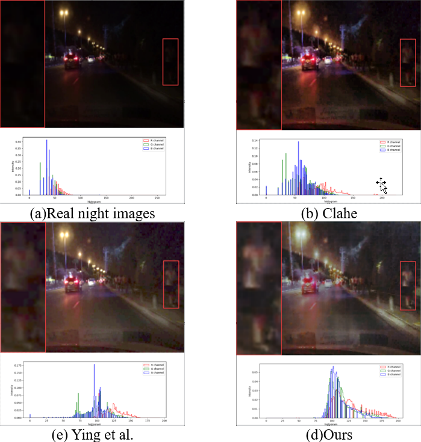

# Low light enhance for driving scene
Images of road scene in low-illumination environment are often loss the details revealing the essence of images which increases the danger when driving at night, especially in those areas without any light. Therefore, an efficient deblurring, enhancement algorithm for low-illumination images is necessary. Here is a CNN based model to restore the low-illumination image.


## Methodology
Our model was inspired by U-net, we used some 1x1 conv to replace 3x3 conv which make it more efficient. Besides, we add [group normalization](https://arxiv.org/abs/1803.08494) in each layer before activation function. During training, we randomly add gaussian blur, gaussian noise to enhance the generalization performance of the model. 
<div align=center></div>

## Comparison Example
In our expeiment, our method has the PSNR/SSMI with 26.70/0.93. Here are some comparison when the model was applied in extreme dark scene and real night scene.
### Extreme dark scene enhance
<div align=left></div>

### Real night scene enhance
<div align=left></div>
<div align=left></div>

## How to use code
### Requirement
```
tensorflow >= 1.6.0
imgaug ==0.2.8
opencv-python == 3.3.1.11
```
### 1. Download the dataset
to do
### 2. Training
Below script gives you an example of training a model with our models.
```
python train.py --batch_size=10 --learning_rate=1e-3 --f_log_step=20 --f_summary_step=20 --f_save_step=2000
```
### 3. Prediction
Below script gives you an example of training a model with our models.
```
CHECKPOINT_DIR_NAME: something like /usr/my_dir/checkpoint
python predict.py --checkpoint_dir=CHECKPOINT_DIR_NAME
```
### 4. Evaluation
Below script gives you an example of training a model with our models.
```
CHECKPOINT_DIR_NAME: something like /usr/my_dir/checkpoint
python eval.py --checkpoint_dir=CHECKPOINT_DIR_NAME
```

## Citations
```
@article{Reza2004,
  title={Realization of the contrast limited adaptive histogram equalization (CLAHE) for real-time image enhancement.},
  author={Reza, Ali M.},
  journal={Journal of VLSI signal processing systems for signal, image and video technology},
  volume={38},
  number={1},
  pages={35--44},
  year={2004}
  publisher={Springer}
}
@article{Jobson1997,
  title={A multiscale retinex for bridging the gap between color images and the human observation of scenes},
  author={Jobson, Daniel J., Zia-ur Rahman, and Glenn A. Woodell.},
  journal={IEEE Transactions on image processing},
  volume={6},
  number={7},
  pages={965--976},
  year={1997},
  publisher={IEEE}
}
@article{Petro2014,
  title={Multiscale retinex},
  author={Petro, Ana Belén, Catalina Sbert, and Jean-Michel Morel},
  journal={Image Processing On Line},
  pages={71--88},
  year={2014}
  publisher={IPOL Journal} 
}
@inproceedings{ying2017new,
  title={A New Image Contrast Enhancement Algorithm Using Exposure Fusion Framework},
  author={Ying, Zhenqiang and Li, Ge and Ren, Yurui and Wang, Ronggang and Wang, Wenmin},
  booktitle={International Conference on Computer Analysis of Images and Patterns},
  pages={36--46},
  year={2017},
  organization={Springer}
 }
@inproceedings{Chen2017,
  title={Fast image processing with fully-convolutional networks},
  author={Chen, Qifeng, Jia Xu, and Vladlen Koltun.},
  booktitle={Proceedings of the IEEE International Conference on Computer Vision. },
  year={2017},
  organization={IEEE}
}
