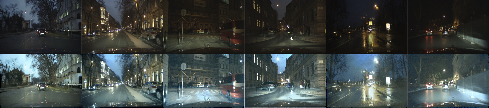

# Low light enhancement for driving scene
Images of road scene in low-illumination environment are often loss the details revealing the essence of images which increases the danger when driving at night, especially in those areas without any light. Therefore, an efficient deblurring, enhancement algorithm for low-illumination images is necessary. Here is a CNN based model to restore the low-illumination image. Following pictures show some enhancement examples from human-generated dark image, and the real night img of bdd100k and eurocity dataset
## Human-generated dark images

## Real night images from Bdd100k

## Real night images from EuroCity


## Methodology
The architecture of our proposed light enhancement network (LE-net) was inspired by many advanced technologies, including linear bottleneck and inversed residual, self attention distillation, and feature pyramid module were used to improve the network performance. During training, we randomly add gaussian blur, gaussian noise to enhance the generalization performance of the model. 
<div align=center></div>

## How to use code
### Requirement
```
tensorflow >= 1.6.0
imgaug ==0.2.8
opencv-python >= 3.3.1.11
scikit-image >=0.15.0
```
### 1. Download the dataset
Please download the corresponding dataset from the official, and extract the daytime images (both training and test dir) in a specific directory, and then set the directory in dataset/bdd_daytime.py
### 2. Training
Below script gives you an example of training a model with our models.
```
python train.py --batch_size=10 --learning_rate=1e-3 --f_log_step=20 --f_summary_step=20 --f_save_step=2000
```
### 3. Prediction
Below script gives you an example of visualing the results after training a model.
```
CHECKPOINT_DIR_NAME: something like /usr/my_dir/checkpoint
python predict.py --checkpoint_dir=CHECKPOINT_DIR_NAME
```
### 4. Evaluation
Below script gives you an example to evaluate the model after training.
```
CHECKPOINT_DIR_NAME: something like /usr/my_dir/checkpoint
python eval.py --checkpoint_dir=CHECKPOINT_DIR_NAME
```
